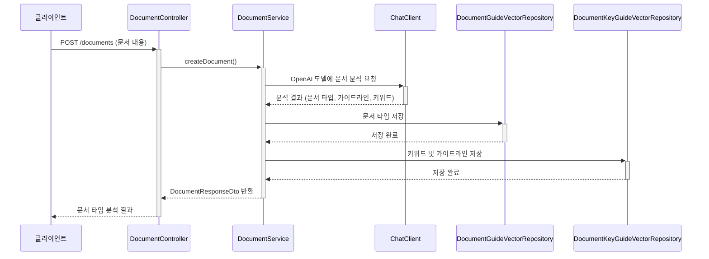
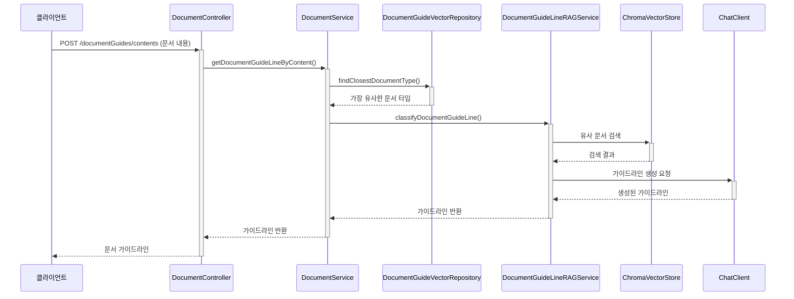
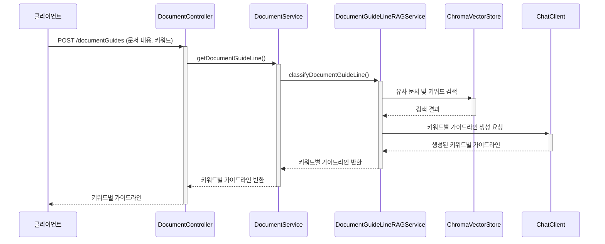

# Spring AI 문서 분석 시스템 API 엔드포인트

## API 개요

Spring AI 문서 분석 시스템은 다음의 REST API 엔드포인트를 제공합니다. 이 API를 통해 문서 분석, 문서 타입별 가이드라인 조회, 키워드별 가이드라인 조회 등의 기능을 활용할 수 있습니다.

## API 엔드포인트 목록

### 1. 문서 생성 및 분석 API

- **URL**: `/documents`
- **Method**: `POST`
- **Description**: 입력된 문서 내용을 분석하여 문서 타입을 분류하고, 분석 결과를 반환합니다.
- **Request Body**:
  ```json
  {
    "documentContent": "회사명: 테크솔루션\n설립일: 2022년 3월\n대표자: 김기술\n사업 분야: AI 솔루션\n투자 요청액: 3억원\n시장 분석: 국내 AI 시장은 연간 20% 성장률을 보이고 있으며...\n수익 모델: 구독형 서비스 및 기업 맞춤형 솔루션..."
  }
  ```
- **Response**:
  ```json
  {
    "documentContent": "회사명: 테크솔루션\n설립일: 2022년 3월\n대표자: 김기술\n사업 분야: AI 솔루션\n투자 요청액: 3억원\n시장 분석: 국내 AI 시장은 연간 20% 성장률을 보이고 있으며...\n수익 모델: 구독형 서비스 및 기업 맞춤형 솔루션...",
    "documentType": "사업계획서"
  }
  ```
- **구현 클래스**: `DocumentController`
- **서비스 메소드**: `DocumentService.createDocument()`

### 2. 문서 내용 기반 가이드라인 조회 API

- **URL**: `/documentGuides/contents`
- **Method**: `POST`
- **Description**: 입력된 문서 내용과 가장 유사한 문서 타입을 찾아 해당 타입의 가이드라인을 반환합니다.
- **Request Body**: 
  ```
  회사명: 테크솔루션\n설립일: 2022년 3월\n대표자: 김기술\n사업 분야: AI 솔루션\n투자 요청액: 3억원
  ```
- **Response**: 
  ```
  사업계획서는 투자자나 이해관계자에게 사업의 핵심 정보와 가치를 전달하는 문서입니다. 객관적인 데이터와 명확한 사업 모델을 제시해야 합니다. 핵심 정보는 간결하게 요약하고, 재무 계획과 시장 분석을 포함하세요. 전문적인 어조를 유지하며 구체적인 수치와 예상 결과를 명시하는 것이 중요합니다.
  ```
- **구현 클래스**: `DocumentController`
- **서비스 메소드**: `DocumentService.getDocumentGuideLineByContent()`

### 3. 문서 타입/키워드 기반 가이드라인 조회 API

- **URL**: `/documentGuides`
- **Method**: `POST`
- **Description**: 문서 타입이나 문서 내용과 특정 키워드를 기반으로 해당 키워드에 대한 가이드라인을 반환합니다.
- **Request Body**:
  ```json
  {
    "documentContent": "2025 지원사업에 따른 사업계획서 입니다. 이거는 ...",
    "key": "투자 요청액"
  }
  ```
  또는 키워드 없이:
  ```json
  {
    "documentContent": "사업계획서"
  }
  ```
- **Response**:
  ```
  투자 요청액은 사업 계획에 필요한 자금 규모를 명확히 표현해야 합니다. 구체적인 금액을 명시하고, 이 금액이 어떻게 활용될지 항목별로 세분화하여 제시하세요. 투자금 사용 계획과 예상 회수 기간도 함께 언급하는 것이 좋습니다.
  ```
- **구현 클래스**: `DocumentController`
- **서비스 메소드**: 
  - `DocumentService.getDocumentGuideLine(String documentContent)` - 문서 타입만 제공할 경우
  - `DocumentService.getDocumentGuideLine(String documentContent, String key)` - 문서 타입과 키워드 모두 제공할 경우

## API 동작 흐름

### 1. 문서 생성 및 분석 API 흐름



### 2. 문서 내용 기반 가이드라인 조회 API 흐름



### 3. 키워드 기반 가이드라인 조회 API 흐름



## 컨트롤러 구현

```java
@RestController
@Slf4j
@RequiredArgsConstructor
public class DocumentController {

    private final DocumentService documentService;

    @PostMapping("/documents")
    public ResponseEntity<DocumentResponseDto> createDocument(
            @RequestBody
            DocumentCreateRequestDto requestDto
    ) {
        return ResponseEntity.status(200).body(documentService.createDocument(requestDto));
    }

    @PostMapping("/documentGuides/contents")
    public ResponseEntity<String> getDocumentGuideLineByContent(
            @RequestBody
            String request
    ) {
        return ResponseEntity.status(200).body(documentService.getDocumentGuideLineByContent(request));
    }

    @PostMapping("/documentGuides")
    public ResponseEntity<String> getDocumentGuideLine(
            @RequestBody
            DocumentGuideLineRequestDto requestDto
    ) {
        log.info("getDocumentGuideLine");
        if (requestDto.key() != null && !requestDto.key().trim().isEmpty()) {
            log.info("search with {} {}", requestDto.documentContent(), requestDto.key());
            return ResponseEntity.status(200).body(documentService.getDocumentGuideLine(
                    requestDto.documentContent(), requestDto.key()));
        }

        log.info("search with {}", requestDto.documentContent());
        return ResponseEntity.status(200).body(documentService.getDocumentGuideLine(
                requestDto.documentContent()));
    }
}
```

## DTO 객체

### 요청 DTO

```java
public record DocumentCreateRequestDto(String documentContent) {}

public record DocumentGuideLineRequestDto(String documentContent, String key) {}
```

### 응답 DTO

```java
public record DocumentResponseDto(String documentContent, String documentType) {}

public record DocumentAnalysisResponseDto(
        @JsonProperty("documentContent") String documentType,
        String documentGuideLine,
        String documentDescription,
        List<DocumentKeyGuide> keys
) {}

public record DocumentKeyGuide(String key, String guideLine) {}
```

## API 사용 예시

### 1. cURL을 이용한 문서 분석 요청

```bash
curl -X POST http://localhost:8080/documents \
  -H "Content-Type: application/json" \
  -d '{"documentContent": "회사명: 테크솔루션\n설립일: 2022년 3월\n대표자: 김기술\n사업 분야: AI 솔루션\n투자 요청액: 3억원\n시장 분석: 국내 AI 시장은 연간 20% 성장률을 보이고 있으며...\n수익 모델: 구독형 서비스 및 기업 맞춤형 솔루션..."}'
```

### 2. cURL을 이용한 문서 내용 기반 가이드라인 조회

```bash
curl -X POST http://localhost:8080/documentGuides/contents \
  -H "Content-Type: text/plain" \
  -d '회사명: 테크솔루션\n설립일: 2022년 3월\n대표자: 김기술\n사업 분야: AI 솔루션\n투자 요청액: 3억원'
```

### 3. cURL을 이용한 키워드 기반 가이드라인 조회

```bash
curl -X POST http://localhost:8080/documentGuides \
  -H "Content-Type: application/json" \
  -d '{"documentContent": "사업계획서", "key": "투자 요청액"}'
``` 