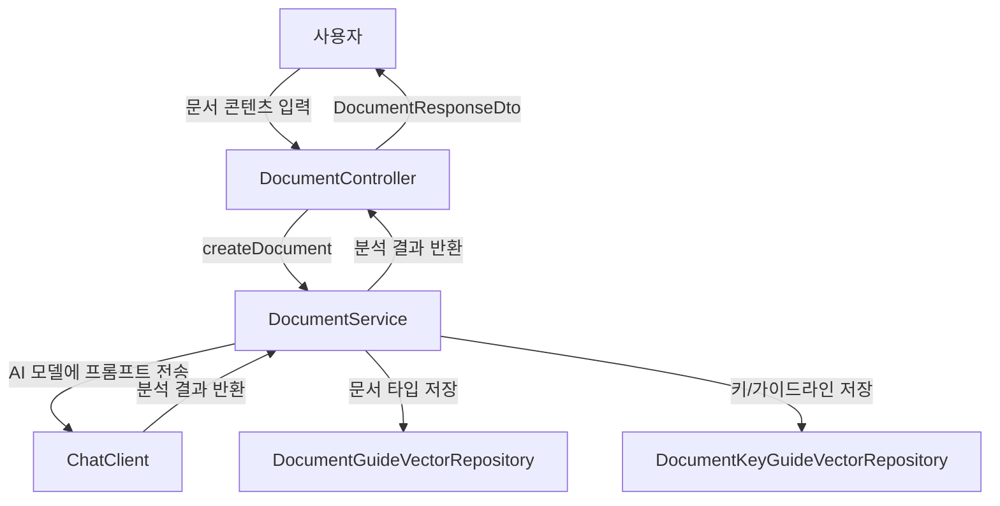
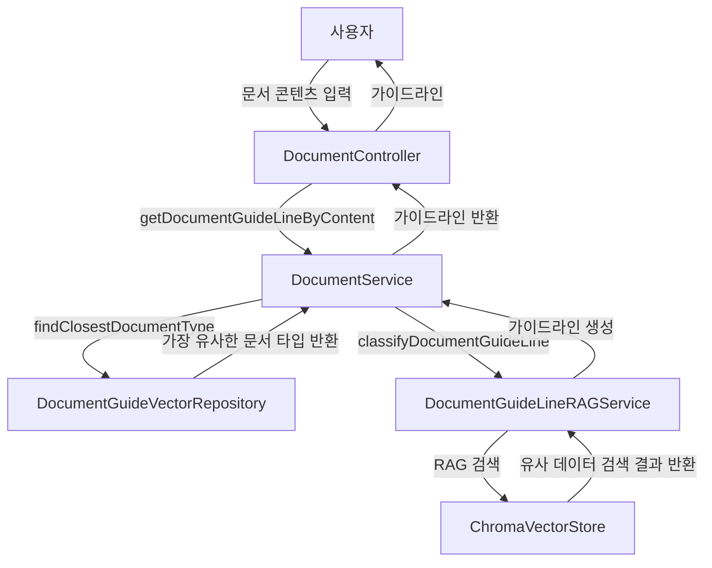
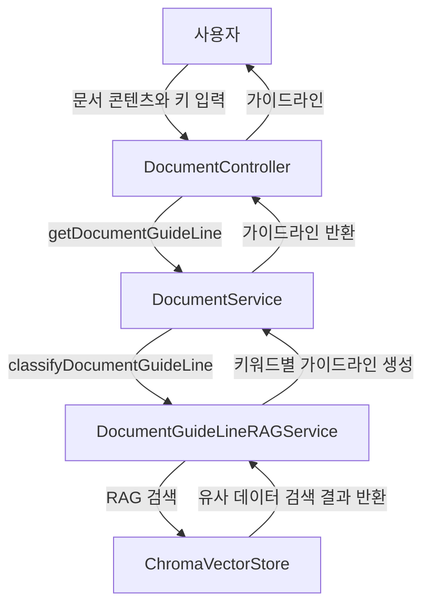

# Spring AI 문서 분석 시스템 플로우

## 시스템 개요
이 시스템은 Spring AI v1.0.0을 활용한 문서 분석 및 가이드라인 생성 시스템입니다. 사용자가 입력한 문서를 분석하여 문서 타입을 분류하고, 해당 문서 타입에 맞는 작성 가이드라인을 제공합니다. 또한 문서 내 특정 키워드에 대한 상세 가이드라인도 제공합니다.

## 주요 컴포넌트
- **문서 분석 서비스**: 사용자가 입력한 문서를 분석하여 문서 타입을 분류
- **가이드라인 생성 서비스**: 문서 타입에 따른 작성 가이드라인 생성
- **벡터 저장소**: ChromaDB를 이용한 문서 임베딩 및 유사도 검색
- **OpenAI 통합**: 문서 분석 및 가이드라인 생성을 위한 AI 모델 활용

## 시스템 아키텍처
```
사용자 요청 → API 컨트롤러 → 서비스 레이어 → AI 모델 통합/벡터 저장소 → 사용자 응답
```

## 데이터 플로우

### 1. 문서 생성 및 분석 플로우


### 2. 문서 가이드라인 조회 플로우


### 3. 키워드별 가이드라인 조회 플로우


## API 엔드포인트

### 1. 문서 생성 및 분석 API
- **엔드포인트**: `POST /documents`
- **요청 본문**: 문서 내용
- **응답**: 문서 내용과 분석된 문서 타입

### 2. 문서 내용 기반 가이드라인 조회 API
- **엔드포인트**: `POST /documentGuides/contents`
- **요청 본문**: 문서 내용
- **응답**: 문서 내용에 기반한 작성 가이드라인

### 3. 문서 타입/키워드 기반 가이드라인 조회 API
- **엔드포인트**: `POST /documentGuides`
- **요청 본문**: 문서 내용과 선택적 키워드
- **응답**: 문서 타입 또는 키워드에 기반한 작성 가이드라인

## 벡터 저장소 구성

시스템은 두 개의 ChromaDB 컬렉션을 사용합니다:
1. **document-type-guide**: 문서 타입과 해당 가이드라인 저장
2. **document-type-key-guide**: 문서 타입, 키 및 해당 가이드라인 저장

## AI 모델 통합

- **OpenAI 모델**: 문서 분석 및 가이드라인 생성
- **Embedding 모델**: 문서 내용 벡터화 및 유사도 검색

## 시스템 동작 과정

1. 사용자가 문서 내용을 시스템에 제공합니다.
2. 시스템은 OpenAI 모델을 통해 문서 타입을 분석합니다.
3. 분석된 문서 타입과 관련 가이드라인을 벡터 저장소에 저장합니다.
4. 사용자가 문서 타입 또는 특정 키워드에 대한 가이드라인을 요청합니다.
5. 시스템은 벡터 저장소에서 가장 유사한 문서 타입/키워드를 검색합니다.
6. RAG(Retrieval-Augmented Generation) 기법을 사용하여 관련 가이드라인을 생성합니다.
7. 생성된 가이드라인을 사용자에게 반환합니다. 